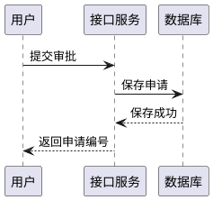
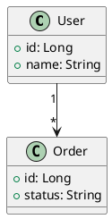
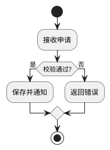
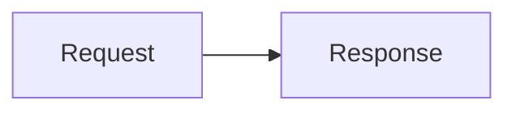

# BetterCodex PlantUML 验收示例

请用 Codex 的 **Rendered Markdown Preview** 打开此文件，不是 Source / Diff。
成功时显示图片，可切换源码和放大；源码不被写回或删除。

## 中文时序图



## 简单类图（Viz.js 布局）



## 活动图



## 错误回退（应保留源码）

```plantuml
@startuml
this is ??? definitely not valid???
@enduml
```

## 隐私限制（应明确拒绝，不访问 URL）

```plantuml
@startuml
!include https://example.com/private.puml
@enduml
```

## Mermaid 对照（仍由 Codex 负责，不受增强影响）



## 普通代码对照（不要误渲染）

```text
@startuml
A -> B: 这只是普通文本示例
@enduml
```
